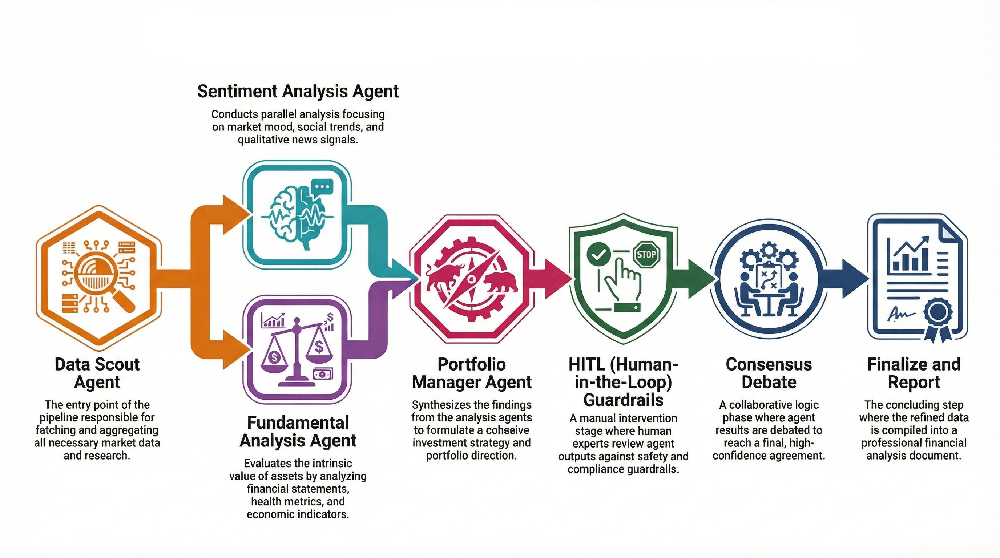

<div align="center">

# Aegis Flux

### Multi Agent AI Investment Analysis System with Local LLMs, Consensus Debates, and Human in the Loop Controls

<a href="https://python.org"></a>
<a href="https://fastapi.tiangolo.com"></a>
<a href="https://langchain.com"></a>
<a href="https://langchain.com"></a>
<a href="https://ollama.ai/"></a>
<a href="https://pydantic.dev"></a>
<a href="https://postgresql.org"></a>
<a href="https://tavily.com"></a>
<a href="https://docker.com"></a>

<br/>


<br/>

*Aegis Flux is a production ready multi agent investment analysis system that I built to demonstrate how sophisticated financial analysis can be achieved through collaborative AI agents, consensus building debates, and configurable human oversight. The system orchestrates specialized agents that fetch market data, analyze technical indicators, evaluate fundamentals, gauge sentiment, and debate their positions before a Portfolio Manager synthesizes everything into actionable investment recommendations with full auditability.*

</div>

---

## Table of Contents

1. [Overview](#1-overview)
   - 1.1 [The Problem I Wanted to Solve](#11-the-problem-i-wanted-to-solve)
   - 1.2 [My Technical Solution](#12-my-technical-solution)
   - 1.3 [Key Capabilities](#13-key-capabilities)
   - 1.4 [Why I Built This](#14-why-i-built-this)
2. [Project Structure](#2-project-structure)
   - 2.1 [Directory Layout](#21-directory-layout)
   - 2.2 [Core Components](#22-core-components)
   - 2.3 [Module Responsibilities](#23-module-responsibilities)
3. [System Architecture](#3-system-architecture)
   - 3.1 [Pipeline Overview](#31-pipeline-overview)
   - 3.2 [Data Flow](#32-data-flow)
   - 3.3 [Agent Interactions](#33-agent-interactions)
   - 3.4 [Consensus Mechanism](#34-consensus-mechanism)
   - 3.5 [Design Decisions](#35-design-decisions)
4. [Agents Deep Dive](#4-agents-deep-dive)
   - 4.1 [Data Scout Agent](#41-data-scout-agent)
   - 4.2 [Technical Analyst Agent](#42-technical-analyst-agent)
   - 4.3 [Fundamental Analyst Agent](#43-fundamental-analyst-agent)
   - 4.4 [Sentiment Analyst Agent](#44-sentiment-analyst-agent)
   - 4.5 [Portfolio Manager Agent](#45-portfolio-manager-agent)
   - 4.6 [Consensus and Debate System](#46-consensus-and-debate-system)
5. [Technical Indicators](#5-technical-indicators)
   - 5.1 [Momentum Indicators](#51-momentum-indicators)
   - 5.2 [Trend Indicators](#52-trend-indicators)
   - 5.3 [Volatility Indicators](#53-volatility-indicators)
   - 5.4 [Volume Indicators](#54-volume-indicators)
6. [Guardrails and Human in the Loop](#6-guardrails-and-human-in-the-loop)
   - 6.1 [Guardrail Configuration](#61-guardrail-configuration)
   - 6.2 [Review Triggers](#62-review-triggers)
   - 6.3 [Human Review Workflow](#63-human-review-workflow)
7. [Real Time Web Research](#7-real-time-web-research)
   - 7.1 [Market Research Integration](#71-market-research-integration)
   - 7.2 [Data Scout Deep Research](#72-data-scout-deep-research)
   - 7.3 [Agent Research Consumption](#73-agent-research-consumption)
8. [API Reference](#8-api-reference)
   - 8.1 [FastAPI Endpoints](#81-fastapi-endpoints)
   - 8.2 [Analysis Endpoints](#82-analysis-endpoints)
   - 8.3 [Agents Endpoints](#83-agents-endpoints)
   - 8.4 [Health Endpoints](#84-health-endpoints)
   - 8.5 [WebSocket Streaming](#85-websocket-streaming)
9. [Quick Start](#9-quick-start)
   - 9.1 [Prerequisites](#91-prerequisites)
   - 9.2 [Installation with uv](#92-installation-with-uv)
   - 9.3 [Installation with pip](#93-installation-with-pip)
   - 9.4 [Environment Configuration](#94-environment-configuration)
   - 9.5 [Running the TUI](#95-running-the-tui)
   - 9.6 [Running the API Server](#96-running-the-api-server)
   - 9.7 [Docker Deployment](#97-docker-deployment)
10. [Scripts and Utilities](#10-scripts-and-utilities)
    - 10.1 [API Server Script](#101-api-server-script)
    - 10.2 [Analysis Testing Script](#102-analysis-testing-script)
    - 10.3 [Agent Debugging Script](#103-agent-debugging-script)
    - 10.4 [Performance Benchmarking](#104-performance-benchmarking)
11. [PDF Reports](#11-pdf-reports)
    - 11.1 [Report Structure](#111-report-structure)
    - 11.2 [Report Generation](#112-report-generation)
12. [Configuration Reference](#12-configuration-reference)
    - 12.1 [Environment Variables](#121-environment-variables)
    - 12.2 [Guardrail Options](#122-guardrail-options)

---

## 1. Overview

### 1.1 The Problem I Wanted to Solve

Investment analysis traditionally requires multiple specialists working together, each bringing their expertise to evaluate a stock from different angles. A technical analyst reads charts and indicators, a fundamental analyst digs into financial statements, and a sentiment analyst gauges market mood. These specialists then debate their findings before arriving at a recommendation.

I wanted to replicate this collaborative process using AI agents. The challenge was not just running multiple models in parallel, but creating a system where agents could share information, debate their positions, and reach genuine consensus rather than simple majority voting.

### 1.2 My Technical Solution

I built Aegis Flux as a LangGraph based multi agent system that orchestrates specialized agents through a cyclic workflow. Each agent has its own expertise, system prompt, and analysis methods. The Data Scout agent performs deep web research and passes comprehensive market intelligence to all other agents. When agents disagree, they enter a structured debate where they argue their positions and can be convinced to change their views based on evidence.

The system uses Ollama for local LLM inference, eliminating API costs and keeping data private. I integrated real time web research capabilities that silently power all agents without exposing implementation details to users.

### 1.3 Key Capabilities

The system provides multi agent collaboration where five specialized agents work together on every analysis. Each agent receives comprehensive market research from the Data Scout and can access additional real time data when needed. The consensus mechanism allows agents to debate and reach agreement rather than relying on simple voting.

Human in the Loop controls let you configure exactly when human review is required. The guardrails system monitors confidence levels, checks for conflicting signals, and enforces policies like always reviewing SELL decisions.

Professional PDF reports capture the full analysis with charts, tables, and the complete investment thesis. The FastAPI backend exposes all functionality through REST endpoints and WebSocket streaming for real time progress updates.

### 1.4 Why I Built This

I built Aegis Flux to explore several technical challenges that interested me. First, how can multiple AI agents genuinely collaborate rather than just run in parallel? The debate mechanism addresses this by allowing agents to influence each other based on evidence. Second, how can we make AI systems auditable and controllable? The HITL guardrails provide configurable human oversight. Third, how can we integrate real time web data seamlessly? The market research system shows how agents can be powered by live data without exposing the implementation.

---

## 2. Project Structure

### 2.1 Directory Layout

```
aegis-flux/
├── src/
│   ├── agents/                 # All agent implementations
│   │   ├── base.py             # Abstract base agent class
│   │   ├── data_scout.py       # Data retrieval and market research
│   │   ├── technical_analyst.py # Technical indicator analysis
│   │   ├── fundamental_analyst.py # Financial health analysis
│   │   ├── sentiment_analyst.py # Market sentiment analysis
│   │   ├── portfolio_manager.py # Decision synthesis
│   │   └── consensus.py        # Debate and consensus mechanism
│   ├── api/                    # FastAPI REST API
│   │   ├── main.py             # FastAPI app configuration
│   │   ├── schemas.py          # Pydantic request/response models
│   │   ├── dependencies.py     # Dependency injection
│   │   └── routers/            # API route handlers
│   │       ├── analysis.py     # Analysis endpoints
│   │       ├── agents.py       # Agent debugging endpoints
│   │       └── health.py       # Health check endpoints
│   ├── cli/                    # Command line interface
│   │   ├── interactive.py      # Main CLI entry point
│   │   └── tui/                # Textual TUI components
│   ├── config/                 # Configuration management
│   │   └── settings.py         # Pydantic settings
│   ├── data/                   # Data clients and tools
│   │   ├── tavily_client.py    # Web research client
│   │   ├── tavily_tools.py     # LangChain tool wrappers
│   │   └── financial_apis.py   # Financial data aggregator
│   ├── graph/                  # LangGraph workflow
│   │   ├── workflow.py         # Main analysis graph
│   │   ├── workflow_streaming.py # Streaming workflow
│   │   └── guardrails.py       # HITL guardrails
│   ├── llm/                    # LLM client abstraction
│   │   └── ollama_client.py    # Ollama integration
│   ├── memory/                 # Conversation memory
│   ├── reports/                # PDF report generation
│   └── state/                  # State management
├── scripts/                    # Utility scripts
│   ├── run_api.py              # Start API server
│   ├── test_analysis.py        # Test API endpoints
│   ├── debug_agents.py         # Debug individual agents
│   └── benchmark.py            # Performance benchmarking
├── data/                       # Generated data and reports
│   └── reports/                # PDF reports output
├── pyproject.toml              # Project dependencies
└── docker-compose.yml          # Docker configuration
```

### 2.2 Core Components

| Component | Location | Purpose |
|-----------|----------|---------|
| Agents | `src/agents/` | Specialized AI agents for different analysis types |
| API | `src/api/` | FastAPI REST endpoints and WebSocket streaming |
| Graph | `src/graph/` | LangGraph workflow orchestration and guardrails |
| Data | `src/data/` | External data sources and web research tools |
| Reports | `src/reports/` | PDF report generation with charts |
| TUI | `src/cli/tui/` | Terminal user interface with Textual |

### 2.3 Module Responsibilities

The **agents module** contains all agent implementations inheriting from `BaseAgent`. Each agent has a name, role, system prompt, and `analyze()` method that takes state and returns updated state.

The **graph module** implements the LangGraph workflow that orchestrates agent execution. The workflow is cyclic, allowing for refinement loops when confidence is too low.

The **data module** handles external data integration including Yahoo Finance for market data and the web research client for real time information.

The **api module** provides a complete REST API for programmatic access to the analysis system, including WebSocket support for streaming progress updates.

---

## 3. System Architecture

### 3.1 Pipeline Overview

The analysis pipeline follows a directed graph structure implemented in LangGraph. The flow begins with the Data Scout agent fetching all necessary data, then proceeds through parallel analysis by the three specialist agents, culminates in the Portfolio Manager synthesizing the results, and optionally triggers human review before finalization.



### 3.2 Data Flow

The state object flows through all nodes in the graph, accumulating results as it progresses. Each agent reads from state and writes its analysis back to state. The key state fields include:

| Field | Set By | Used By |
|-------|--------|---------|
| `ticker` | User Input | All Agents |
| `price_data` | Data Scout | Technical Analyst |
| `company_info` | Data Scout | Fundamental, Sentiment |
| `market_research` | Data Scout | All Analyst Agents |
| `technical_signal` | Technical Analyst | Portfolio Manager |
| `fundamental_signal` | Fundamental Analyst | Portfolio Manager |
| `sentiment_signal` | Sentiment Analyst | Portfolio Manager |
| `consensus_decision` | Debate System | Portfolio Manager |
| `manager_decision` | Portfolio Manager | Guardrails, Report |

### 3.3 Agent Interactions

Agents interact through the shared state object. The Data Scout performs comprehensive market research and stores it in `market_research`, which all other agents consume. This design ensures consistent, fresh data across all analyses without redundant API calls.

When agents produce conflicting signals, the consensus debate mechanism activates. Each agent argues for their position using their analysis and the relevant market research. The debate runs for multiple rounds until consensus is reached or a majority vote determines the outcome.

### 3.4 Consensus Mechanism

The debate system is implemented in `src/agents/consensus.py`. When agents disagree, each takes turns arguing their position. The arguments are evaluated, and agents can change their positions if convinced by evidence. The debate continues until either all agents agree or the maximum rounds are reached.

During debates, each agent receives agent specific context from the market research. Technical Analysts get technical insights, Fundamental Analysts get financial research, and Sentiment Analysts get social sentiment data. This ensures arguments are grounded in current market data.

### 3.5 Design Decisions

I chose LangGraph for orchestration because it provides built in support for cyclic graphs, state management, and checkpointing. The cyclic capability is essential for the refinement loops when confidence is below threshold.

I used Ollama for local LLM inference to eliminate API costs and latency while keeping data private. The system supports any Ollama compatible model, defaulting to Llama 3.2.

The market research architecture centralizes data fetching in the Data Scout agent to avoid redundant API calls and ensure all agents work with consistent data.

---

## 4. Agents Deep Dive

### 4.1 Data Scout Agent

The Data Scout is the first agent in the pipeline and has the critical responsibility of gathering all data that other agents will need. I designed it to perform deep web research covering multiple domains:

**Data Sources:**
- Yahoo Finance for price history, company info, financials, and recommendations
- Real time web research for technical insights, fundamental research, sentiment sources, risk factors, and competitor analysis

**Key Methods:**

```python
def fetch_market_research(self, ticker: str) -> dict[str, Any]:
    """Fetch deep market research for comprehensive analysis."""
    # Technical analysis insights from the web
    # Fundamental analysis research
    # Sentiment and social sources
    # Risk factors
    # Competitor analysis
```

The `market_research` dictionary is passed to all downstream agents, ensuring they have access to the latest information without making their own API calls.

### 4.2 Technical Analyst Agent

The Technical Analyst calculates and interprets a comprehensive set of technical indicators. It consumes price data from the Data Scout and technical insights from market research.

**Indicators Calculated:**
- RSI (Relative Strength Index)
- MACD (Moving Average Convergence Divergence)
- Stochastic Oscillator
- ADX (Average Directional Index)
- Bollinger Bands
- Williams %R
- CCI (Commodity Channel Index)
- ROC (Rate of Change)
- OBV (On Balance Volume)
- Moving Averages (SMA 20, SMA 50, EMA 12)
- ATR (Average True Range)

**Signal Generation:**

The agent counts bullish and bearish signals from all indicators and generates an overall signal with confidence based on the signal distribution.

### 4.3 Fundamental Analyst Agent

The Fundamental Analyst evaluates the company's financial health and valuation. It calculates key ratios and integrates real time fundamental research from the market research data.

**Analysis Components:**
- P/E Ratio interpretation
- Forward P/E and PEG estimation
- Dividend yield assessment
- Beta and volatility profile
- Market cap categorization
- 52 week range analysis
- Overall health scoring

**Health Assessment:**

The agent produces a health score from 0 to 100 and categorizes it as Strong, Moderate, or Weak based on multiple factors.

### 4.4 Sentiment Analyst Agent

The Sentiment Analyst gauges market mood by analyzing news and social sentiment sources. It uses market intelligence from the Data Scout and can perform additional sentiment research when needed.

**Analysis Process:**
1. Aggregate sentiment from company context and news
2. Extract numerical sentiment score from analysis
3. Map score to Bullish, Neutral, or Bearish signal
4. Identify potential catalysts

### 4.5 Portfolio Manager Agent

The Portfolio Manager synthesizes all agent signals and makes the final investment decision. I designed this agent to speak on behalf of the team, always using "We" rather than "I" to emphasize the collaborative nature of the decision.

**Decision Framework:**
- Aggregates all agent signals with confidence weighting
- Uses consensus decision from debates when available
- Determines position size based on confidence and consensus
- Generates comprehensive investment thesis

**Output Fields:**
- Decision: BUY, SELL, or HOLD
- Confidence: 0 to 100 percent
- Position Size: Conservative, Moderate, or Aggressive
- Investment thesis with rationale and risks

### 4.6 Consensus and Debate System

When agents produce conflicting signals, the debate system activates. Each agent argues for their position over multiple rounds. The debate includes:

**Debate Flow:**
1. Check initial positions for consensus
2. If disagreement, start debate rounds
3. Each agent argues their position with supporting evidence
4. Evaluate if any agent should change position
5. Check for new consensus
6. Repeat until consensus or max rounds reached
7. Fall back to majority vote if needed

**Agent Context During Debates:**

Each agent receives relevant market research context for their arguments:
- Technical Analyst: Technical insights from web research
- Fundamental Analyst: Financial research and competitor data
- Sentiment Analyst: Social sentiment sources

---

## 5. Technical Indicators

### 5.1 Momentum Indicators

| Indicator | Description | Bullish Signal | Bearish Signal |
|-----------|-------------|----------------|----------------|
| RSI | Measures speed and magnitude of price changes | Below 30 (oversold) | Above 70 (overbought) |
| Stochastic | Compares closing price to price range | %K crosses above %D below 20 | %K crosses below %D above 80 |
| Williams %R | Similar to Stochastic but inverted | Below 80 (oversold) | Above 20 (overbought) |
| CCI | Measures deviation from average | Below 100 (oversold) | Above 100 (overbought) |
| ROC | Rate of price change | Positive value | Negative value |

### 5.2 Trend Indicators

| Indicator | Description | Bullish Signal | Bearish Signal |
|-----------|-------------|----------------|----------------|
| MACD | Difference between EMAs | MACD above signal line | MACD below signal line |
| ADX | Trend strength measurement | +DI above DI with ADX above 25 | DI above +DI with ADX above 25 |
| SMA | Simple moving average | Price above SMA, SMA 20 above SMA 50 | Price below SMA, SMA 20 below SMA 50 |
| EMA | Exponential moving average | Price above EMA | Price below EMA |

### 5.3 Volatility Indicators

| Indicator | Description | Signal |
|-----------|-------------|--------|
| Bollinger Bands | Price channels based on standard deviation | Overbought when price above upper band, oversold when below lower |
| ATR | Average true range for volatility measurement | High ATR indicates high volatility, low ATR indicates consolidation |

### 5.4 Volume Indicators

| Indicator | Description | Bullish Signal | Bearish Signal |
|-----------|-------------|----------------|----------------|
| OBV | On Balance Volume cumulative indicator | Rising OBV with rising price | Falling OBV with rising price (divergence) |

---

## 6. Guardrails and Human in the Loop

### 6.1 Guardrail Configuration

The guardrails system provides configurable policies for human oversight. You can customize thresholds and rules:

```python
from src.graph.guardrails import GuardrailConfig

config = GuardrailConfig(
    min_confidence_for_auto_approve=0.75,  # Auto approve above 75%
    min_confidence_for_action=0.50,         # Minimum for any action
    max_position_size_auto="Moderate",      # Auto approve up to moderate
    require_consensus_for_auto=True,        # Require agent agreement
    always_review_decisions=["SELL"],       # Always review sells
)
```

### 6.2 Review Triggers

The guardrails system monitors several conditions that trigger human review:

| Trigger | Condition | Rationale |
|---------|-----------|-----------|
| Low Confidence | Below threshold | Uncertain decisions need human judgment |
| Conflicting Signals | Agents disagree | Human resolves persistent disagreement |
| Aggressive Position | Large position size | Risk management oversight |
| High Volatility | High ATR or beta | Extra caution in volatile conditions |
| Policy Enforcement | SELL decisions | Always review certain action types |

### 6.3 Human Review Workflow

When review is triggered, the system provides a complete context for human decision making:

```
============================================================
  HUMAN REVIEW REQUIRED
============================================================

Review ID: review_20260119_093500
Ticker: TSLA
Proposed Decision: BUY
Confidence: 72%

Review Triggers:
   Low confidence in the decision
   Analysts have conflicting signals

Agent Signals:
   Technical: Bullish (75%)
   Fundamental: Bullish (65%)
   Sentiment: Neutral (55%)

OPTIONS:
  [A] Approve the proposed decision
  [R] Reject and mark for re analysis
  [E] Edit and modify the decision
  [Q] Quit without decision

Your choice (A/R/E/Q): 
```

---

## 7. Real Time Web Research

### 7.1 Market Research Integration

I integrated comprehensive web research capabilities that power all agents silently. The system uses Tavily for AI powered web search, but agents simply receive "Latest Market Research" without knowing the underlying implementation.

### 7.2 Data Scout Deep Research

The Data Scout performs multiple search queries to build comprehensive market intelligence:

```python
market_research = {
    "research_available": True,
    "technical_insights": "...",      # Chart patterns, support/resistance
    "fundamental_research": "...",     # Earnings, valuation, financial health
    "sentiment_sources": "...",        # Social media, investor opinions
    "risk_factors": "...",             # Risks, concerns, challenges
    "competitor_analysis": "...",      # Industry comparison, market share
}
```

### 7.3 Agent Research Consumption

Each agent receives agent specific data from the market research:

| Agent | Research Used |
|-------|---------------|
| Technical Analyst | `technical_insights` for chart patterns and levels |
| Fundamental Analyst | `fundamental_research`, `competitor_analysis`, `risk_factors` |
| Sentiment Analyst | `sentiment_sources` for social sentiment |
| Portfolio Manager | `risk_factors` for risk assessment |
| Consensus Debate | Agent specific context during arguments |

---

## 8. API Reference

### 8.1 FastAPI Endpoints

The API is organized into three routers mounted at `/api/v1/`:

| Router | Prefix | Purpose |
|--------|--------|---------|
| Health | `/api/v1/health` | System health checks |
| Agents | `/api/v1/agents` | Agent inspection and testing |
| Analysis | `/api/v1/analyze` | Stock analysis operations |

### 8.2 Analysis Endpoints

**Start Analysis**
```
POST /api/v1/analyze
Content-Type: application/json

{
    "ticker": "AAPL",
    "depth": "standard",
    "enable_hitl": false
}
```

**Response:**
```json
{
    "id": "abc123",
    "ticker": "AAPL",
    "status": "completed",
    "decision": "BUY",
    "confidence": 78,
    "position_size": "Moderate",
    "thesis": "...",
    "technical_signal": {"signal": "Bullish", "confidence": 0.75},
    "fundamental_signal": {"signal": "Bullish", "confidence": 0.70},
    "sentiment_signal": {"signal": "Neutral", "confidence": 0.55},
    "duration_ms": 45000
}
```

**Get Analysis Result**
```
GET /api/v1/analyze/{analysis_id}
```

**List Cached Analyses**
```
GET /api/v1/analyze
```

### 8.3 Agents Endpoints

**List All Agents**
```
GET /api/v1/agents
```

**Get Agent Info**
```
GET /api/v1/agents/{name}
```

**Test Agent**
```
POST /api/v1/agents/{name}/test
Content-Type: application/json

{
    "ticker": "TSLA"
}
```

**Get Agent Configuration**
```
GET /api/v1/agents/{name}/config
```

### 8.4 Health Endpoints

**Basic Health**
```
GET /api/v1/health
```

**Ollama Status**
```
GET /api/v1/health/ollama
```

**Tavily Status**
```
GET /api/v1/health/tavily
```

### 8.5 WebSocket Streaming

Connect to the WebSocket endpoint to receive real time analysis updates:

```
WebSocket: ws://localhost:8000/api/v1/analyze/{ticker}/stream
```

Events are sent as JSON with event type and data:

```json
{"event": "started", "data": {"ticker": "AAPL"}}
{"event": "agent_start", "agent": "data_scout", "data": {...}}
{"event": "agent_done", "agent": "data_scout", "data": {...}}
{"event": "completed", "data": {"decision": "BUY", "confidence": 78}}
```

---

## 9. Quick Start

### 9.1 Prerequisites

Before starting, ensure you have:

- Python 3.13 or higher
- Ollama installed and running with a compatible model (llama3.2 recommended)
- Optional: Tavily API key for real time web research
- Optional: Docker and Docker Compose for containerized deployment

### 9.2 Installation with uv

I recommend using uv for fast and reliable Python package management:

```bash
# Clone the repository
git clone https://github.com/yourusername/aegis-flux.git
cd aegis-flux

# Install dependencies with uv
uv sync

# Activate the virtual environment
source .venv/bin/activate
```

### 9.3 Installation with pip

Alternatively, use pip with a traditional virtual environment:

```bash
# Clone the repository
git clone https://github.com/yourusername/aegis-flux.git
cd aegis-flux

# Create virtual environment
python -m venv .venv
source .venv/bin/activate

# Install dependencies
pip install -e .
```

### 9.4 Environment Configuration

Copy the example environment file and configure your settings:

```bash
cp .env.example .env
```

Edit `.env` with your configuration:

```bash
# Ollama Configuration (required)
OLLAMA_BASE_URL=http://localhost:11434
OLLAMA_LLM_MODEL=llama3.2

# Tavily API (optional, enables real time research)
TAVILY_API_KEY=tvly-your-api-key-here

# Analysis Settings
MAX_ITERATIONS=5
AGENT_TEMPERATURE=0.3
```

### 9.5 Running the TUI

Launch the interactive terminal user interface:

```bash
# Using uv
uv run aegisflux

# Or directly
python main.py
```

Use the `/analyze TICKER` command to start an analysis.

### 9.6 Running the API Server

Start the FastAPI server:

```bash
# Development mode with auto reload
python scripts/run_api.py --reload

# Production mode
python scripts/run_api.py --host 0.0.0.0 --port 8000
```

Access the API documentation at `http://localhost:8000/docs`

### 9.7 Docker Deployment

Deploy with Docker Compose:

```bash
# Build and start containers
docker compose up -d

# View logs
docker compose logs -f

# Stop containers
docker compose down
```

---

## 10. Scripts and Utilities

### 10.1 API Server Script

Start the API server with configurable options:

```bash
python scripts/run_api.py --help

# Options:
#   --host     Host to bind (default: 0.0.0.0)
#   --port     Port to bind (default: 8000)
#   --reload   Enable auto reload for development
#   --workers  Number of worker processes
```

### 10.2 Analysis Testing Script

Test all API endpoints:

```bash
python scripts/test_analysis.py --help

# Options:
#   --base-url    API base URL (default: http://localhost:8000)
#   --ticker      Ticker to test (default: AAPL)
#   --skip-analysis  Skip the slow analysis test
```

### 10.3 Agent Debugging Script

Debug individual agents with detailed output:

```bash
python scripts/debug_agents.py technical_analyst TSLA --verbose

# Arguments:
#   agent     Agent name (data_scout, technical_analyst, etc.)
#   ticker    Stock ticker to analyze
#   --verbose Show detailed output including system prompts
```

### 10.4 Performance Benchmarking

Measure analysis performance:

```bash
python scripts/benchmark.py --ticker MSFT --runs 3

# Options:
#   --ticker   Ticker to benchmark (default: AAPL)
#   --runs     Number of benchmark runs (default: 1)
```

---

## 11. PDF Reports

### 11.1 Report Structure

Generated reports include comprehensive documentation of the analysis:

| Section | Contents |
|---------|----------|
| Cover Page | Branding, ticker, decision summary, timestamp |
| Executive Summary | Decision metrics, signal distribution chart |
| Technical Analysis | All indicators in tables, trend assessment |
| Fundamental Analysis | Financial ratios, health score, valuation |
| Sentiment Analysis | Sentiment score, market mood, catalysts |
| Investment Thesis | Full recommendation with rationale |
| Risk Factors | Identified risks and concerns |
| Disclaimer | Legal disclaimer |

Reports are saved to `data/reports/` with timestamp and ticker in the filename.

### 11.2 Report Generation

Generate reports programmatically:

```python
from src.reports import PDFReportGenerator
from src.graph import run_analysis

result, _ = run_analysis("AAPL", enable_hitl=False)

generator = PDFReportGenerator()
pdf_path = generator.generate(result)
print(f"Report saved: {pdf_path}")
```

---

## 12. Configuration Reference

### 12.1 Environment Variables

| Variable | Required | Default | Description |
|----------|----------|---------|-------------|
| `OLLAMA_BASE_URL` | Yes | `http://localhost:11434` | Ollama server URL |
| `OLLAMA_LLM_MODEL` | Yes | `llama3.2` | Model to use for agents |
| `TAVILY_API_KEY` | No | None | Enables real time web research |
| `MAX_ITERATIONS` | No | `5` | Maximum refinement iterations |
| `AGENT_TEMPERATURE` | No | `0.3` | LLM temperature for agents |
| `DATABASE_URL` | No | None | PostgreSQL connection for checkpointing |

### 12.2 Guardrail Options

| Option | Type | Default | Description |
|--------|------|---------|-------------|
| `min_confidence_for_auto_approve` | float | 0.75 | Auto approve above this confidence |
| `min_confidence_for_action` | float | 0.50 | Minimum confidence for any action |
| `max_position_size_auto` | str | "Moderate" | Max position size for auto approve |
| `require_consensus_for_auto` | bool | True | Require agent consensus for auto |
| `always_review_decisions` | list | ["SELL"] | Decision types that always require review |
| `enable_confidence_check` | bool | True | Enable confidence monitoring |
| `enable_consistency_check` | bool | True | Enable signal consistency checking |

---

<div align="center">

*Built with passion for AI agents and financial technology*

</div>
